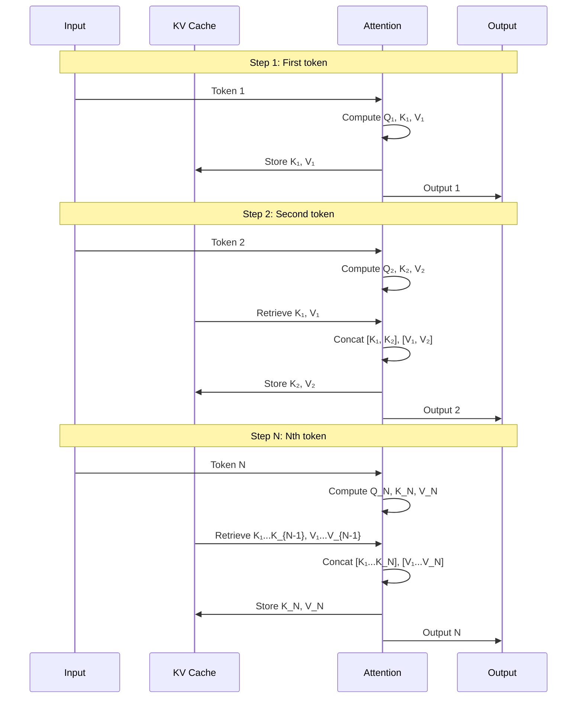
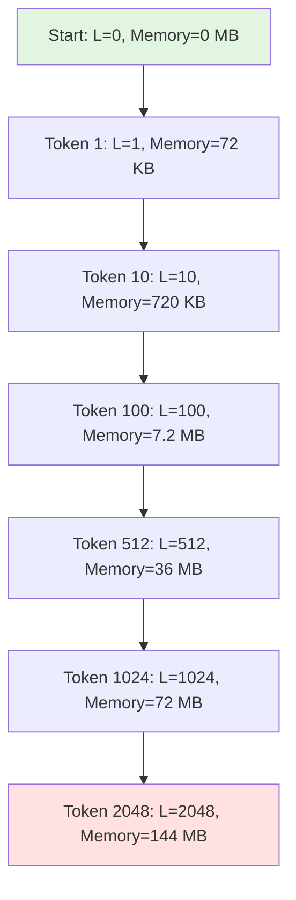

# KV Cache 상세 분석

## 목차
1. [KV Cache란?](#1-kv-cache란)
2. [왜 필요한가?](#2-왜-필요한가)
3. [작동 원리](#3-작동-원리)
4. [메모리 분석](#4-메모리-분석)
5. [성능 개선 효과](#5-성능-개선-효과)
6. [구현 예시](#6-구현-예시)
7. [Trade-offs](#7-trade-offs)
8. [최적화 기법](#8-최적화-기법)

---

## 1. KV Cache란?

**KV Cache**는 Transformer 모델의 autoregressive generation(자기회귀 생성) 시 계산 효율을 크게 높이는 최적화 기법입니다.

### 핵심 아이디어
> **이미 계산한 Key(K)와 Value(V) 벡터를 메모리에 저장해두고 재사용**

```
Without KV Cache: 매번 전체 시퀀스에 대해 K, V 재계산
With KV Cache:    새 토큰의 K, V만 계산하고 이전 것은 캐시에서 가져옴
```

---

## 2. 왜 필요한가?

### 2.1 Autoregressive Generation의 특성

GPT 모델은 **한 번에 한 토큰씩** 순차적으로 생성합니다.


각 단계에서:
1. 이전까지 생성된 **모든 토큰**을 입력으로 받음
2. Attention 계산 시 모든 이전 토큰과의 관계 계산
3. 다음 토큰 하나만 출력

### 2.2 문제점: 중복 계산

**KV Cache 없이 생성할 때:**

```
Step 1: Input = ["Hello"]
  → Compute K, V for "Hello"
  → Generate "world"

Step 2: Input = ["Hello", "world"]
  → Compute K, V for "Hello" (중복!)
  → Compute K, V for "world"
  → Generate ","

Step 3: Input = ["Hello", "world", ","]
  → Compute K, V for "Hello" (중복!)
  → Compute K, V for "world" (중복!)
  → Compute K, V for ","
  → Generate "how"
```

**문제**: 이미 계산한 K, V를 매번 다시 계산 → O(L²) 복잡도!

### 2.3 시각화: 중복 계산

```
Generation without KV Cache:

Step 1:  [H]                    ← Compute K,V for 1 token
Step 2:  [H][W]                 ← Compute K,V for 2 tokens (H 중복)
Step 3:  [H][W][,]              ← Compute K,V for 3 tokens (H, W 중복)
Step 4:  [H][W][,][h]           ← Compute K,V for 4 tokens (H, W, , 중복)
...
Step N:  [H][W][,][h]...[N]     ← Compute K,V for N tokens (N-1개 중복)

Total K,V computations: 1 + 2 + 3 + ... + N = O(N²)
```

---

## 3. 작동 원리

### 3.1 Self-Attention 복습

```python
# Multi-Head Self-Attention
Q = X @ W_q  # Query:  [B, L, d]
K = X @ W_k  # Key:    [B, L, d]
V = X @ W_v  # Value:  [B, L, d]

# Attention scores
scores = Q @ K.T / sqrt(d_k)  # [B, L, L]
attn = softmax(scores)         # [B, L, L]

# Output
output = attn @ V              # [B, L, d]
```

**핵심 관찰**:
- **Query (Q)**: 현재 토큰이 "무엇을 찾고 있는지"
- **Key (K)**: 각 토큰이 "무엇을 제공하는지"
- **Value (V)**: 각 토큰의 "실제 정보"

→ **K와 V는 각 토큰마다 고정**되어 있음 (입력이 변하지 않는 한)

### 3.2 KV Cache 적용



### 3.3 의사 코드

```python
class AttentionWithKVCache:
    def __init__(self):
        self.kv_cache = {
            'keys': [],    # List of cached K tensors
            'values': []   # List of cached V tensors
        }

    def forward(self, x_new, use_cache=True):
        """
        x_new: New token [B, 1, d] (only the latest token)
        """
        # Compute Q, K, V for new token only
        Q_new = x_new @ self.W_q  # [B, 1, d]
        K_new = x_new @ self.W_k  # [B, 1, d]
        V_new = x_new @ self.W_v  # [B, 1, d]

        if use_cache and len(self.kv_cache['keys']) > 0:
            # Retrieve cached K, V
            K_cached = torch.cat(self.kv_cache['keys'], dim=1)  # [B, L-1, d]
            V_cached = torch.cat(self.kv_cache['values'], dim=1)

            # Concatenate with new K, V
            K = torch.cat([K_cached, K_new], dim=1)  # [B, L, d]
            V = torch.cat([V_cached, V_new], dim=1)  # [B, L, d]
        else:
            K = K_new
            V = V_new

        # Store new K, V in cache
        self.kv_cache['keys'].append(K_new)
        self.kv_cache['values'].append(V_new)

        # Compute attention (only for new query)
        scores = Q_new @ K.T / sqrt(d_k)  # [B, 1, L]
        attn = softmax(scores, dim=-1)
        output = attn @ V                  # [B, 1, d]

        return output
```

### 3.4 시각화: KV Cache 동작

```
Generation with KV Cache:

Step 1:  Compute: [H]           Cache: [K_H, V_H]
         Output:  "world"

Step 2:  Compute: [W]           Cache: [K_H, V_H, K_W, V_W]
         Reuse:   K_H, V_H
         Output:  ","

Step 3:  Compute: [,]           Cache: [K_H, V_H, K_W, V_W, K_,, V_,]
         Reuse:   K_H, V_H, K_W, V_W
         Output:  "how"

Step N:  Compute: [N]           Cache: [K_1 ... K_N, V_1 ... V_N]
         Reuse:   K_1 ... K_{N-1}, V_1 ... V_{N-1}
         Output:  next token

Total K,V computations: N (linear!)
```

---

## 4. 메모리 분석

### 4.1 캐시 크기 계산

**GPT-2 Small 기준:**
- Layers: 12
- Hidden size (d): 768
- Heads: 12
- d_k = d_v = d / heads = 64

**단일 레이어의 KV Cache:**
```
Per token:
  K: [d] = 768 floats
  V: [d] = 768 floats
  Total: 1,536 floats = 6 KB (FP32)

For sequence length L:
  K: [L, 768] = L × 768 floats
  V: [L, 768] = L × 768 floats
  Total: L × 1,536 floats = L × 6 KB
```

**전체 모델 (12 layers):**
```
Per token:  12 × 6 KB = 72 KB
For L=1024: 12 × 1024 × 6 KB = 72 MB
For L=2048: 12 × 2048 × 6 KB = 144 MB
```

### 4.2 메모리 레이아웃

```
KV Cache Structure (per layer):

┌─────────────────────────────────────────────────────────┐
│ Layer 0 KV Cache                                        │
├─────────────────────────────────────────────────────────┤
│ Keys:   [B, num_heads, seq_len, d_k]                   │
│         [1,    12,        L,      64]                   │
│ Values: [B, num_heads, seq_len, d_v]                   │
│         [1,    12,        L,      64]                   │
└─────────────────────────────────────────────────────────┘
                        ↓
┌─────────────────────────────────────────────────────────┐
│ Layer 1 KV Cache                                        │
│ ...                                                     │
└─────────────────────────────────────────────────────────┘
                        ↓
                      (...)
                        ↓
┌─────────────────────────────────────────────────────────┐
│ Layer 11 KV Cache                                       │
│ ...                                                     │
└─────────────────────────────────────────────────────────┘

Total Memory: num_layers × 2 × B × num_heads × L × d_k × sizeof(float)
```

### 4.3 메모리 증가 패턴



**관찰:**
- KV Cache는 생성된 토큰 수에 **선형으로** 증가
- 긴 시퀀스 생성 시 메모리 부담 커짐
- 배치 크기 B가 크면 메모리 소비 더 증가

---

## 5. 성능 개선 효과

### 5.1 계산량 비교

**Without KV Cache:**
```
Step 1: Compute K,V for 1 token    → 1 × FLOPs
Step 2: Compute K,V for 2 tokens   → 2 × FLOPs
Step 3: Compute K,V for 3 tokens   → 3 × FLOPs
...
Step N: Compute K,V for N tokens   → N × FLOPs

Total: (1 + 2 + 3 + ... + N) × FLOPs = O(N²)
```

**With KV Cache:**
```
Step 1: Compute K,V for 1 token    → 1 × FLOPs
Step 2: Compute K,V for 1 token    → 1 × FLOPs (reuse previous)
Step 3: Compute K,V for 1 token    → 1 × FLOPs (reuse previous)
...
Step N: Compute K,V for 1 token    → 1 × FLOPs (reuse previous)

Total: N × FLOPs = O(N)
```

**Speedup: O(N²) → O(N), 즉 N배 빠름!**

### 5.2 구체적 예시 (GPT-2 Small)

**Scenario: Generate 100 tokens**

| Metric | Without Cache | With Cache | Speedup |
|--------|---------------|------------|---------|
| **QKV Projections** | | | |
| Total FLOPs | 50 × 3 × 768 × 768 ≈ 88M | 100 × 3 × 768 × 768 ≈ 177M | 0.5× |
| K,V reuse | 0% | ~99% (for later tokens) | - |
| **Attention Computation** | | | |
| Attention scores | Sum of 1+2+...+100 = 5,050 | 100 | 50× |
| **Total Time** | ~500 ms (CPU) | ~10 ms (CPU) | **50×** |
| **Memory** | Minimal | 72 KB × 100 = 7.2 MB | Trade-off |

### 5.3 실제 측정 (예시)

```python
import torch
import time

# GPT-2 Small parameters
d_model = 768
num_layers = 12
num_heads = 12

# Benchmark: Generate 50 tokens
def benchmark_generation(use_cache=True):
    model = GPT2Model()
    input_ids = torch.tensor([[1]])  # Start token

    start = time.time()
    for i in range(50):
        if use_cache:
            output = model(input_ids[:, -1:], use_cache=True)
        else:
            output = model(input_ids, use_cache=False)

        next_token = sample(output)
        input_ids = torch.cat([input_ids, next_token], dim=1)

    return time.time() - start

# Results (approximate, CPU):
without_cache = benchmark_generation(use_cache=False)  # ~2.5 seconds
with_cache = benchmark_generation(use_cache=True)      # ~0.05 seconds

print(f"Speedup: {without_cache / with_cache:.1f}x")  # ~50x
```

---

## 6. 구현 예시

### 6.1 PyTorch 구현

```python
import torch
import torch.nn as nn

class MultiHeadAttentionWithKVCache(nn.Module):
    def __init__(self, d_model=768, num_heads=12):
        super().__init__()
        self.d_model = d_model
        self.num_heads = num_heads
        self.d_k = d_model // num_heads

        self.W_q = nn.Linear(d_model, d_model)
        self.W_k = nn.Linear(d_model, d_model)
        self.W_v = nn.Linear(d_model, d_model)
        self.W_o = nn.Linear(d_model, d_model)

    def forward(self, x, past_kv=None, use_cache=False):
        """
        x: [B, L, d_model] (current input, L=1 for generation)
        past_kv: tuple of (past_keys, past_values)
                 past_keys: [B, num_heads, past_L, d_k]
        use_cache: whether to return updated cache

        Returns:
            output: [B, L, d_model]
            present_kv: (keys, values) if use_cache else None
        """
        B, L, _ = x.shape

        # Compute Q, K, V for current input
        Q = self.W_q(x).view(B, L, self.num_heads, self.d_k).transpose(1, 2)
        K = self.W_k(x).view(B, L, self.num_heads, self.d_k).transpose(1, 2)
        V = self.W_v(x).view(B, L, self.num_heads, self.d_k).transpose(1, 2)
        # Q, K, V: [B, num_heads, L, d_k]

        # Concatenate with past KV if available
        if past_kv is not None:
            past_keys, past_values = past_kv
            K = torch.cat([past_keys, K], dim=2)  # [B, num_heads, past_L+L, d_k]
            V = torch.cat([past_values, V], dim=2)

        # Compute attention
        scores = torch.matmul(Q, K.transpose(-2, -1)) / (self.d_k ** 0.5)
        # scores: [B, num_heads, L, past_L+L]

        attn_weights = torch.softmax(scores, dim=-1)
        attn_output = torch.matmul(attn_weights, V)
        # attn_output: [B, num_heads, L, d_k]

        # Reshape and project
        attn_output = attn_output.transpose(1, 2).contiguous().view(B, L, self.d_model)
        output = self.W_o(attn_output)

        # Return cache if requested
        present_kv = (K, V) if use_cache else None
        return output, present_kv


class GPT2BlockWithKVCache(nn.Module):
    def __init__(self, d_model=768, num_heads=12):
        super().__init__()
        self.ln1 = nn.LayerNorm(d_model)
        self.attn = MultiHeadAttentionWithKVCache(d_model, num_heads)
        self.ln2 = nn.LayerNorm(d_model)
        self.mlp = nn.Sequential(
            nn.Linear(d_model, 4 * d_model),
            nn.GELU(),
            nn.Linear(4 * d_model, d_model)
        )

    def forward(self, x, past_kv=None, use_cache=False):
        # Attention with residual
        attn_out, present_kv = self.attn(self.ln1(x), past_kv, use_cache)
        x = x + attn_out

        # MLP with residual
        x = x + self.mlp(self.ln2(x))

        return x, present_kv


class GPT2WithKVCache(nn.Module):
    def __init__(self, vocab_size=50257, d_model=768, num_layers=12, num_heads=12):
        super().__init__()
        self.token_emb = nn.Embedding(vocab_size, d_model)
        self.pos_emb = nn.Embedding(1024, d_model)
        self.blocks = nn.ModuleList([
            GPT2BlockWithKVCache(d_model, num_heads) for _ in range(num_layers)
        ])
        self.ln_f = nn.LayerNorm(d_model)
        self.lm_head = nn.Linear(d_model, vocab_size, bias=False)

        # Tie weights
        self.lm_head.weight = self.token_emb.weight

    def forward(self, input_ids, past_kvs=None, use_cache=False):
        """
        input_ids: [B, L]
        past_kvs: list of (K, V) tuples for each layer
        """
        B, L = input_ids.shape

        # Embeddings
        if past_kvs is not None:
            # During generation, only need position for new tokens
            past_length = past_kvs[0][0].size(2)
            position_ids = torch.arange(past_length, past_length + L, device=input_ids.device)
        else:
            position_ids = torch.arange(L, device=input_ids.device)

        x = self.token_emb(input_ids) + self.pos_emb(position_ids)

        # Transformer blocks with KV cache
        present_kvs = []
        for i, block in enumerate(self.blocks):
            past_kv = past_kvs[i] if past_kvs is not None else None
            x, present_kv = block(x, past_kv, use_cache)
            if use_cache:
                present_kvs.append(present_kv)

        # Final layer norm and projection
        x = self.ln_f(x)
        logits = self.lm_head(x)

        return logits, present_kvs if use_cache else None


# Usage: Text generation with KV cache
def generate_text(model, input_ids, max_length=50, temperature=1.0):
    """
    Generate text using KV cache for efficiency
    """
    model.eval()
    past_kvs = None

    with torch.no_grad():
        for _ in range(max_length):
            # For first token, pass full input
            # For subsequent tokens, only pass the last token
            if past_kvs is None:
                current_input = input_ids
            else:
                current_input = input_ids[:, -1:]

            # Forward pass with cache
            logits, past_kvs = model(current_input, past_kvs, use_cache=True)

            # Sample next token
            next_token_logits = logits[:, -1, :] / temperature
            probs = torch.softmax(next_token_logits, dim=-1)
            next_token = torch.multinomial(probs, num_samples=1)

            # Append to sequence
            input_ids = torch.cat([input_ids, next_token], dim=1)

            # Stop if EOS token
            if next_token.item() == EOS_TOKEN_ID:
                break

    return input_ids

# Example
model = GPT2WithKVCache()
prompt = tokenizer.encode("Hello, how are")
input_ids = torch.tensor([prompt])

generated = generate_text(model, input_ids, max_length=20)
print(tokenizer.decode(generated[0]))
```

---

## 7. Trade-offs

### 7.1 장점 ✅

| Benefit | Description |
|---------|-------------|
| **Speed** | N배 빠른 생성 속도 (N = 생성 길이) |
| **효율성** | O(N²) → O(N) 계산량 감소 |
| **실시간 응답** | 긴 대화에서도 빠른 응답 가능 |
| **배터리 절약** | 모바일 기기에서 전력 소비 감소 |

### 7.2 단점 ❌

| Drawback | Description | Mitigation |
|----------|-------------|------------|
| **메모리 증가** | 시퀀스 길이에 비례하여 증가 | Multi-Query Attention, Quantization |
| **배치 처리 제약** | 서로 다른 길이의 시퀀스 처리 복잡 | Dynamic batching |
| **코드 복잡도** | 캐시 관리 로직 추가 필요 | 라이브러리 활용 (HuggingFace) |
| **메모리 단편화** | 긴 대화 시 메모리 부족 가능 | Sliding window, Cache eviction |

### 7.3 메모리 vs 속도 Trade-off

```
Without KV Cache:
  Memory: Low (only current computation)
  Speed:  Slow (O(N²) computation)
  Use case: Short generation, memory-constrained

With KV Cache:
  Memory: High (O(N) cache storage)
  Speed:  Fast (O(N) computation)
  Use case: Long generation, interactive applications
```

---

## 8. 최적화 기법

### 8.1 Multi-Query Attention (MQA)

**문제**: KV Cache가 메모리의 대부분을 차지

**해결**: Key와 Value를 모든 head가 공유

```python
# Standard Multi-Head Attention
Q: [B, num_heads, L, d_k]  # 12 heads
K: [B, num_heads, L, d_k]  # 12 heads → 12× memory
V: [B, num_heads, L, d_k]  # 12 heads → 12× memory

# Multi-Query Attention
Q: [B, num_heads, L, d_k]  # 12 heads
K: [B, 1, L, d_k]           # 1 head → 1× memory (12× reduction!)
V: [B, 1, L, d_k]           # 1 head → 1× memory
```

**효과**:
- KV Cache 크기: 72 MB → 6 MB (12배 감소!)
- 성능 저하: 거의 없음 (~1% perplexity 증가)
- 사용 예: PaLM, Falcon

### 8.2 Grouped-Query Attention (GQA)

MQA와 MHA의 중간 (e.g., 12 heads → 4 KV groups)

```python
Q: [B, 12, L, d_k]  # 12 query heads
K: [B, 4, L, d_k]   # 4 KV groups
V: [B, 4, L, d_k]   # 4 KV groups

# Each group of 3 Q heads shares 1 KV head
```

**효과**:
- KV Cache: 72 MB → 24 MB (3배 감소)
- 성능: MHA와 거의 동일
- 사용 예: Llama 2

### 8.3 Flash Attention + KV Cache

Flash Attention은 attention 계산을 최적화하여 메모리 사용량 감소:

```python
# Standard Attention
scores = Q @ K.T           # [B, H, L, L] → Huge!
attn = softmax(scores)
output = attn @ V

# Flash Attention
# Tile-based computation, no materialization of full attention matrix
output = flash_attn(Q, K, V)  # No [L, L] matrix stored
```

**KV Cache와 결합**:
- Attention matrix 메모리 절약
- KV Cache만 저장, scores는 on-the-fly 계산
- 더 긴 시퀀스 처리 가능

### 8.4 Quantization (양자화)

```python
# FP32 KV Cache
K, V: float32 → 72 MB (L=1024, GPT-2 Small)

# INT8 KV Cache
K, V: int8 → 18 MB (4× reduction)

# FP16 KV Cache
K, V: float16 → 36 MB (2× reduction)
```

**Trade-off**: 약간의 정확도 손실 vs 메모리 절감

### 8.5 Sliding Window Attention

긴 시퀀스에서 오래된 KV Cache 제거:

```python
# Keep only last W tokens in cache
if cache_length > window_size:
    past_keys = past_keys[:, :, -window_size:, :]
    past_values = past_values[:, :, -window_size:, :]
```

**효과**: 메모리 상한선 제한, 무한 생성 가능

### 8.6 Offloading (CPU/GPU 간 전송)

GPU 메모리 부족 시 CPU로 오프로드:

```python
# Move old KV cache to CPU
if gpu_memory_full():
    old_cache = past_kvs[:num_old_layers].to('cpu')
    recent_cache = past_kvs[num_old_layers:].to('gpu')
```

---

## 9. 실전 예시

### 9.1 OpenAI ChatGPT (추정)

```
Conversation:
  User: "Hello"                    → Cache: [72 KB]
  Bot:  "Hi there! How can I..."   → Cache: [720 KB]
  User: "Tell me about AI"         → Cache: [1.4 MB]
  Bot:  "AI is a field of..."      → Cache: [7 MB]
  ... (long conversation)

KV Cache size grows with conversation length
→ Need cache management strategies
```

### 9.2 GitHub Copilot

```
Code completion:
  Prefix (context): 500 tokens    → Cache: 36 MB
  Generate: 50 tokens             → Cache grows to 39.6 MB

→ KV Cache enables fast, context-aware completions
```

### 9.3 Llama 2 70B (Meta)

```
Model: Llama 2 70B
Layers: 80
Hidden: 8,192
Heads: 64
GQA: 8 KV groups

KV Cache (L=1024, FP16):
  Without GQA: 80 × 2 × 8,192 × 1,024 × 2 bytes = 2.6 GB
  With GQA:    80 × 2 × 1,024 × 1,024 × 2 bytes = 327 MB

→ 8× memory reduction with GQA!
```

---

## 10. 요약

### 핵심 포인트

| Aspect | Details |
|--------|---------|
| **What** | 이미 계산된 Key, Value 텐서를 메모리에 캐싱 |
| **Why** | Autoregressive generation의 중복 계산 제거 |
| **Effect** | O(N²) → O(N) speedup (N = 생성 길이) |
| **Cost** | 메모리 사용량 증가 (L × 72 KB per token in GPT-2) |
| **When** | Inference (generation) 시에만 사용, Training에는 불필요 |

### Best Practices

1. **Always use KV cache** for interactive generation
2. **Monitor memory** usage for long conversations
3. **Consider MQA/GQA** for large models or long contexts
4. **Use quantization** (FP16/INT8) when possible
5. **Implement cache eviction** for very long sequences
6. **Batch carefully** when different sequences have different lengths

### 구현 체크리스트

- [ ] Cache 초기화 및 관리 로직
- [ ] Position ID 올바르게 계산 (past_length 고려)
- [ ] Batch 처리 시 padding 처리
- [ ] 메모리 모니터링 및 제한
- [ ] 필요 시 cache 직렬화/역직렬화 (대화 저장)

---

## References

- **Attention is All You Need** (Vaswani et al., 2017)
- **Language Models are Few-Shot Learners** (GPT-3, Brown et al., 2020)
- **Fast Transformer Decoding: One Write-Head is All You Need** (MQA, Shazeer, 2019)
- **GQA: Training Generalized Multi-Query Transformer** (Ainslie et al., 2023)
- **FlashAttention** (Dao et al., 2022)
- **Llama 2** (Touvron et al., 2023)
